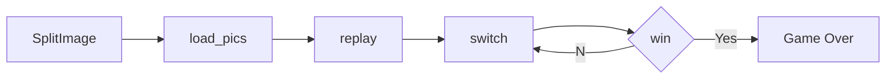

# Puzzle

## Introduction
- EN: The attached Python code allows you to experience the fun of jigsaw puzzles. You can upload any jpg or png images in your local folder (not recommended to be too large) and enter the number of cut rows and columns yourself. Afterwards, the program will disrupt the order of the cut images, allowing players to restore the order.

- CN: 附件的Python代码可以让你享受拼图游戏的乐趣。你可以上传本地文件夹中的任何jpg或png图片（不建议太大），并自行输入切割的行数与列数。之后，程序会将切割后的图片顺序打乱，玩家便可以将顺序复原。

## Design Ideas
- EN: I first defined a class called Square, which is used to represent the cut image. Each image is assigned an ID in order. The first function to run is the "SplitImage" function, which can open a file dialog box, allowing players to select images from local folders, and allowing users to input the number of rows and columns to cut images. Afterwards, the function calculates the size of the cut image, names the cut images in the correct order, and stores them in the location selected by the player. The function of 'SplitImage' will ultimately return four parameters. The first parameter is the location where the cut image is stored, the second and third parameters are the width and height of the image, and the fourth and fifth parameters are the number of columns and rows to cut. The 'board_mk' function generates a two-dimensional array called 'board'. The 'load_pics' function will read the cut images and store them in a list called' Pics'. The 'replay' function is used to shuffle the image order. It calls the 'init_Board' function, which generates' Square 'objects in the shuffled order and stores them in a two-dimensional array' board '. After the 'replay' function is completed, the game begins. The 'switch' function enables players to exchange images. Moreover, this function calls both "drawBoard" and "win" functions simultaneously. The "drawBoard" function displays the cut images in the order of the two-dimensional array "board", and the "win" function determines whether the ID of the "Square" object in the "board" matches the correct image order. If it is correct, it prompts to complete the puzzle.

- CN: 我首先定义了一个名为Square的类，它被用来表示切割后的图片。每个图片按顺序分配一个ID。首先运行的是“SplitImage”函数，它可以打开文件对话框，让玩家选择本地文件夹中的图片，并让用户输入切割图片的行数和列数。之后，函数会计算切割图片的大小，用正确的顺序命名切割后的图片，并把它们存储在玩家选择的图片所在的位置。“SplitImage”的函数最后会返回四个参数，第一个是切割后的图片存放的位置，第二个和第三个分别是图片的宽度和高度，第四个和第五个分别是切割的列数和行数。“board_mk”函数会生成一个名为“board”二维数组。“load_pics”函数会读取切割好的图片，并存放在一个名为“Pics”的列表中。“replay”函数用于打乱图像顺序，它会调用“init_board”函数，该函数按照打乱后的顺序生成“Square”对象，并存放在二维数组“board”中。“replay”函数运行完后，游戏开始。“switch”函数实现了玩家交换图片的功能。而且，该函数同时调用“drawBoard”和“win”两个函数。“drawBoard”函数按照二维数组“board”的顺序展示切割的图片，“win”函数判断“board”中的“Square”对象的ID是否合乎正确的图片顺序，如果正确则提示完成拼图。

